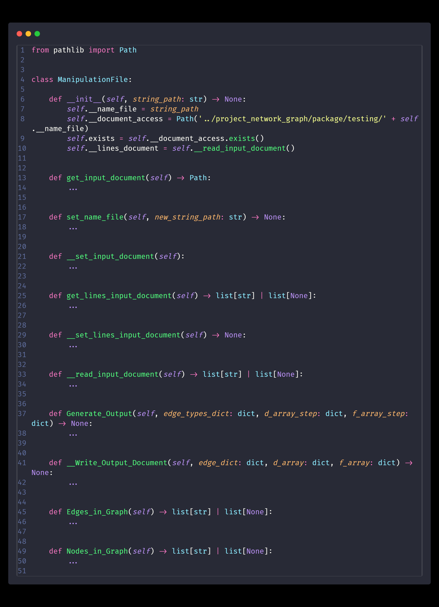
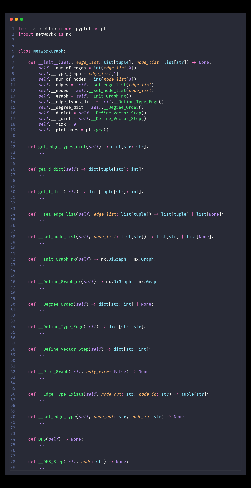

# Visualização de algoritmo DFS com Python e  as bibliotecas Networkx e Pyplot (Matplotlib)

#### Como estamos utilizando o Python, é preciso instalar as dependências que serão as bibliotecas a serem utilizadas; no seu terminal, digite: 

```bash
pip install networkx matplotlib
```
#### Em caso de sucesso, os seguintes comandos retornarão as versões para cada biblioteca:

```bash
pip show matplotlib
pip show networkx
```
#### Após instaladas essas dependências, você já pode operar o arquivo **_main.py_** sem impedimentos.

## 1 - Definição: o que é o DFS?
#### Podemos definir o DFS (Depth-First Search) como:
---
> um algoritmo de busca em estrutura de árvore - ou, no geral, um grafo qualquer -, em que são realizadas chamadas sucessivas deste procedimento para acessar a maior 'cadeia' de vértices adjacentes a partir de um único vértice.


---
#### Com o exemplo acima é possível notar que, quando executamos o DFS e construímos a Árvore de Busca, ela tenderá a ser mais vertical do que horizontal - diferente ao que ocorre no BFS (implementação futura).

## 2 - Ideação e Elaboração de projeto
#### Como o trabalho exigia mais que a implementação do algoritmo, solicitando a nomenclatura das arestas (podendo ser dos tipos: _Árvore_, _Retorno_, _Avanço_ e _Cruzamento_) e os vetores d,f (que representam as marcações de visita ao vértice); sendo opcional a implementação de uma interface gráfica que elucidasse a execução.
#### Com isso, pensamos em como implementar toda a arquitetura do projeto em Python, desde a leitura do arquivo até gerar os resultados solicitados e obviamente apresentar as etapas com a interface. Em primeira análise, para produzir somente a lógica e gerar os outputs, fizemos uma breve implementação no [**Google Colab**](https://colab.research.google.com/drive/1-ZlK8cNi1jby-zjH1B8lqHvdIWSqw6EK?usp=sharing) que, como pode ver no link (ou no arquivo **_playground.py_**), é um código extremamente acoplado e sem design algum - o que nos leva ao próximo passo...
## 3 - Estruturação do projeto com POO
#### Mediante a necessidade de desacoplar um código que ficara muito engessado, foi pensado na separação por responsabilidades, são elas: 

1. manipulação de arquivos (seja para ler o grafo em um arquivo .txt ou gerar um output em mesma extensão);


---
2. tratamento geral do grafo (desde de instaciar uma das classes do Networkx responsável pelo grafo, como plotar o passo a passo do DFS na tela);


---
* PS.: contudo, é facilmente identificável um nível de acoplamento existente em ambas as classes com as respectivas responsabilidades

#### Dessa forma, a classe **ManipulationFile** se comunica com a classe **NetworkGraph** inputando uma lista de arestas e outra lista de vértices, a classe NetworkGraph instacia um objeto da classe _networkx.Graph_ ou _networkx.DiGraph_, roda o DFS e os resultados são informados à classe **ManipulationFile** e este gera um arquivo output com as informações solicitadas.

## **Estrutura do Diretório para o Projeto**
```
├── README.md
├── graph_example.png
├── manipulation_file.png
├── network_graph.png
│
├── package/
│   ├── __init__.py
│   ├── __pycache__/
│   │   └── __init__.cpython-311.pyc
│   │
│   ├── modules/
│   │   ├── ManipulationFile.py
│   │   ├── NetworkGraph.py
│   │   │
│   │   └── __pycache__/
│   │       ├── ManipulationFile.cpython-311.pyc
│   │       ├── NetworkGraph.cpython-311.pyc
│   │       ├── dfs.cpython-311.pyc
│   │       ├── module_dfs.cpython-311.pyc
│   │       ├── network_graph.cpython-311.pyc
│   │       └── network_graph_file.cpython-311.pyc   
│   │   
│   │   
│   │
│   └── testing/
│       ├── Arquivo G1.txt
│       ├── Arquivo G2.txt
│       ├── Arquivo G3.txt
│       ├── Arquivo G4.txt
│       ├── Arquivo G5.txt
│       └── Arquivo G6.txt
│
└── src/
    ├── main.py
    └── playground.py
```
**6 directories, 22 files**
