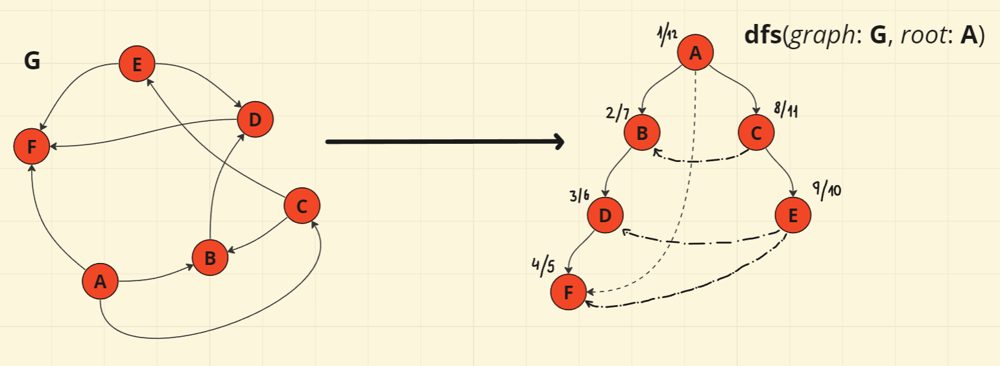

# Manipulação de Grafos e Algoritmos em Python com as Bibliotecas _Network_ e _Matplotlib.Pyplot_

## **Estrutura do Diretório para o Projeto**
```
├── README.md
├── graph_example.png
│
├── package/
│   ├── __init__.py
│   ├── __pycache__/
│   │   └── __init__.cpython-311.pyc
│   │
│   ├── algorithms/
│   │   ├── __pycache__/
│   │   │   ├── Base.cpython-311.pyc
│   │   │   ├── DFS.cpython-311.pyc
│   │   │   ├── BFS.cpython-311.pyc
│   │   │   └── Dijkstra.cpython-311.pyc
│   │   │
│   │   ├── Base.py
│   │   ├── DFS.py
│   │   ├── BFS.py
│   │   └── Dijkstra.py
│   │
│   ├── modules/
│   │   ├── file_manipulation/
│   │   │   ├── InputFile.py
│   │   │   ├── MasterFile.py
│   │   │   └── OutputFile.py
│   │   │
│   │   ├── graph/
│   │   │   ├── GraphVisualization.py
│   │   │   └── NetworkGraph.py
│   │   │
│   │   └── __pycache__/
│   │       ├── ManipulationFile.cpython-311.pyc
│   │       ├── NetworkGraph.cpython-311.pyc
│   │       ├── dfs.cpython-311.pyc
│   │       ├── module_dfs.cpython-311.pyc
│   │       ├── network_graph.cpython-311.pyc
│   │       └── network_graph_file.cpython-311.pyc
│   │
│   └── testing/
│       ├── Arquivo G1.txt
│       ├── Arquivo G2.txt
│       ├── Arquivo G3.txt
│       ├── Arquivo G4.txt
│       ├── Arquivo G5.txt
│       └── Arquivo G6.txt
│
└── src/
    ├── main.py
    └── playground.py
```
**10 diretórios, 31 arquivos**
---

#### Como estamos utilizando o Python, é preciso instalar as dependências que serão as bibliotecas a serem utilizadas; no seu terminal, digite: 

```bash
pip install networkx matplotlib
```
#### Em caso de sucesso, os seguintes comandos retornarão as versões para cada biblioteca:

```bash
pip show matplotlib
pip show networkx
```
#### Após instaladas essas dependências, você já pode operar o arquivo **_main.py_** sem impedimentos.

## 0 - Redefinção de Projeto

## 1 - Ideação e Elaboração de projeto

## 2 - Estruturação do projeto com POO

## 3 - Definição: o que é o DFS?
#### Podemos definir o DFS (Depth-First Search) como:
---
> um algoritmo de busca em estrutura de árvore - ou, no geral, um grafo qualquer -, em que são realizadas chamadas sucessivas deste procedimento para acessar a maior 'cadeia' de vértices adjacentes a partir de um único vértice.


---
#### Com o exemplo acima é possível notar que, quando executamos o DFS e construímos a Árvore de Busca, ela tenderá a ser mais vertical do que horizontal - diferente ao que ocorre no BFS (implementação futura).
